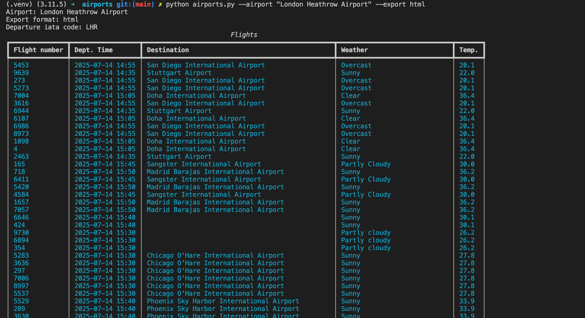

# Airport API Data Project ✈️

## 🧾 Overview

The project involves developing a terminal based, super-powered airports departure board. Taking real-time airport and weather data from public APIs and combining it with other sources to make a useful command line app that will let the user view all departures from a specific airport. 

Our final application will be able to:
- Search for any Airport in the world
- Find all the flights leaving that airport
- Extract the location of all of the destinations of the airports
- Combine that data with the weather at each of the destinations of the flights
- Export this data to a HTML or JSON file

**Note: Example screenshot of CLI output at the end.**
 
This was built as part of a Sigma Labs training sprint on working with APIs, HTTP requests, data transformation, and data validation in Python.

## 🎯 Project Aims

- Use Python to access RESTful APIs using the `requests` library.
- Parse, clean, and validate JSON responses.
- Combine multiple API sources (airport and weather data).
- Apply exception handling and clean coding practices.
- Demonstrate understanding of HTTP status codes, API rate limits, and real-world data variability.

---

## 🔧 Key Tools & Technologies
**Python Core Concepts**:
- HTTP requests and RESTful APIs
- Command Line Interface (CLI) apps using `argparse`
- Exception handling and data validation
- File I/O: reading/writing `.json` and `.html`
- Modular design and clean code principles

**Libraries & Packages**:
- `requests`: For interacting with APIs
- `rich`: For formatted terminal output and optional progress bars
- `argparse`: For building CLI interfaces
- `pytest`: For unit testing
- `pytest-cov`: For measuring test coverage

**Testing & Linting**:
- `pytest`, `pytest-cov`
- `.pylintrc` configuration for Pylint (code linting & static analysis)

**Data Formats**:
- `JSON` (for API responses and exports)
- `HTML` (for export display)

**Other Tools**:
- `curl` (for testing APIs via terminal)

- **Python Libraries/concepts**: ArgParse, Rich, HTTP requests, client/servers, RESTful APIs, curl commands, ETL processes, Pytest, Pytest-coverage
- **Visuals/CLI**: Rich Console 
- **File formats**: JSON, HTML
- **Network**: `Network Tab` in Chrome

---

## 📁 Project Structure

Airport-Departure-API/

-[airports/]
   - `airports.py`: Main CLI script for Airports info
   - `airports.json`: Local dataset of all airports
   - `flight_details_<datetime>_...`(JSON/HTML): Output data from CLI
- [countries/] (Optional) HTTP/API practice folder
   - README.md: Link ...
   - `countries.py`: Fetch country info
   - `test_countries.py`: Pytest for countries.py
- `requirements.txt`: Requests, Rich, etc.
- `.gitignore`: Exclude unnecessary files
- - `.pylintrc`: Pylint config for code linting

---

## ⚙️ Getting Set Up

1. **Clone the repository**
- `git clone https://github.com/yourusername/Airport-Departure-API.git`
- `cd Airport-Departure-API`
  ...

1. **Create and activate a virtual environment**
- `python3 -m venv .venv`
- `source .venv/bin/activate`

1. **Install dependencies**
- `pip install -r requirements.txt`

---

## Running the Project

1. Navigate into the `airports/` directory. 
2. Run `python airports.py --airport <AIRPORT NAME> --export <json or html>`

- Prompts the user to input a valid UK airport 
- Connects to the multiple APIs to retrieve live departure data
- Filters flights by valid UK airport codes
- Use the airport coordinates to fetch current weather data.
- Extracts and processes relevant flight details (airline, flight number, destination, departure time, destination weather etc)
- Print a summary of both sets of information in the CLI.
- Export output data from CLI to a .json and .html file (datetime included in filename).

🕹️**Notes:** 
- These APIs do not require API keys, so you can run the scripts directly without any configuration.
- Both values for `--airport` and `--export` are required when running the script.
- `--airport` value has to be the exact airport name (can be found in `airports.json`).

---

## Additional Information

Data Sources:

1. Airlabs API - Retrieves details about a given airport using the ICAO or IATA code:
   - https://airlabs.co/
   - https://airlabs.co/docs/
2. Local Airports JSON file
3. Weather API - Fetches weather information for the airport's location:
   - https://www.weatherapi.com/docs/
  

---

## 🚀 Next Steps (Ideas for Extension)
✅ Progress Display: Add a progress loader that is displayed when your code is searching the Weather and Airlabs APIs for data. 
- https://rich.readthedocs.io/en/stable/progress.html

✅ Handling Errors: If the server returns with anything apart from 200 then show an appropriate error message. 
Examples: 
- `404`: show an error message about the content not being found. 
- `500`: show an error message explaining the error that happened on the server.

✅ Airport API from Airlabs​: Instead of relying on a local JSON file to retrieve the information about an airport you can use the Airport DB API from Airlabs. This will allow you to get much more detailed information about an airport.
- https://airlabs.co/docs/airports
  
✅ Add Multiprocessing​: The current code might take a long time to run because you need to fetch the weather one-by-one from the weather API for each airport. One solution is to introduce multiprocessing so that the requests can run in parallel rather than in sequence.
- https://www.sitepoint.com/python-multiprocessing-parallel-programming

---

**Example screenshot of CLI output:**

